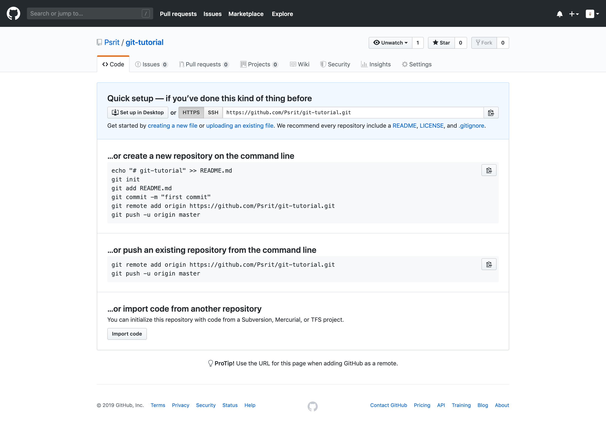

以 GitHub 为例。

首先，在 GitHub 个人页面上点击 “New repository”，然后按照 GitHub 的指导，创建新的远程仓库。



然后执行
```bash
$ git remote add origin https://github.com/Psrit/git-demo.git
$ git remote -v
origin	https://github.com/Psrit/git-demo.git (fetch)
origin	https://github.com/Psrit/git-demo.git (push)
```
这里，`git remote -v` 会列出所有远程仓库的详细信息：

- `origin` 表示远程库的名字，它最初由 `git remote add <shortname> <url>` 中的 `<shortname>` 指定，之后可以通过 `git remote rename <old> <new>` 来重命名。

- `(fetch)` 和 `(push)` 用于指定该远程分支是否具有拉取和推送的权限。

现在开始我们的第一次推送。
```bash
$ git push -u origin master 
Enumerating objects: 24, done.
Counting objects: 100% (24/24), done.
Delta compression using up to 4 threads
Compressing objects: 100% (21/21), done.
Writing objects: 100% (24/24), 2.56 KiB | 1.28 MiB/s, done.
Total 24 (delta 3), reused 0 (delta 0)
remote: Resolving deltas: 100% (3/3), done.
To https://github.com/Psrit/git-demo.git
 * [new branch]      master -> master
Branch 'master' set up to track remote branch 'master' from 'origin'.
```
这里，由于远程库是空的，我们第一次推送 `master` 分支时，加上了 `-u` 参数，Git 不但会把本地的 `master` 分支内容推送的远程新的 `master` 分支，还会把本地的 `master` 分支和远程的 `master` 分支关联起来（建立追踪关系），在以后的推送或者拉取时就可以简化命令，直接使用 `git push`。

`git push` 的一般格式（不考虑命令的选项参数）为：
```bash
$ git push <remote_repo> <local_branch>:<remote_branch>
```
其含义是将本地分支 `<local_branch>` 推送至远程仓库 `<remote_repo>` 下的远程分支 `<remote_branch>`。这三个位置参数可以缺省，举例如下：

- `git push -u origin master:dev`：
将本地分支 `master` 推送至远程分支 `dev`，并将远程 `dev` 设置为 `master` 的上游追踪分支（两者可以不同名）。如果该远程分支不存在，则会被新建：

```bash
$ git push -u origin master:dev1              
Total 0 (delta 0), reused 0 (delta 0)
remote: 
remote: Create a pull request for 'dev1' on GitHub by visiting:
remote:      https://github.com/Psrit/git-demo/pull/new/dev1
remote: 
To https://github.com/Psrit/git-demo.git
 * [new branch]      master -> dev1
Branch 'master' set up to track remote branch 'dev1' from 'origin'.
```

该追踪分支可以在稍后重新指定：
```bash
$ git branch --set-upstream-to=origin/master master 
Branch 'master' set up to track remote branch 'master' from 'origin'.
```

- `git push -u origin master`：
将本地分支 `master` 推送至同名远程分支 `master`，并将远程 `master` 设置为本地 `master` 的上游追踪分支。如果该远程分支不存在，则会被新建。该追踪分支同样可以在稍后重新指定。

- `git push origin master:dev1`：
将本地分支 `master` 推送至远程分支 `dev1`，两者可能不存在追踪关系。

- `git push origin localdev`：
将本地分支 `localdev` 推送至同名远程分支 `localdev`（无论本地 `localdev` 分支有无上游追踪分支且二者是否同名）。如果该远程分支不存在，则会在远程新建同名分支并推送（不会建立追踪关系）：
```bash
$ git branch --unset-upstream localdev  # 解除 localdev 的上游分支绑定
$ git branch -vv
  dev      51e475b [origin/master] Remove .vscode/.
* localdev 51e475b Remove .vscode/.  # 可以看到目前 localdev 无绑定的上游分支
  master   51e475b [origin/master] Remove .vscode/.
$ git push origin localdev 
Total 0 (delta 0), reused 0 (delta 0)
remote: 
remote: Create a pull request for 'localdev' on GitHub by visiting:
remote:      https://github.com/Psrit/git-demo/pull/new/localdev
remote: 
To https://github.com/Psrit/git-demo.git
 * [new branch]      localdev -> localdev
$ git branch -vv
  dev      51e475b [origin/master] Remove .vscode/.
* localdev 51e475b Remove .vscode/.  # 可以看到此时 localdev 仍然无绑定的上游分支
  master   51e475b [origin/master] Remove .vscode/.
```
<!--
如果本地 `localdev` 分支有上游追踪分支 `dev1`，但远程无同名分支 `localdev`，那么该命令仍然会在远程新建同名分支并推送（不会建立追踪关系）：
```bash
$ git branch -vv
  dev      51e475b [origin/master] Remove .vscode/.
* localdev 51e475b [origin/dev1] Remove .vscode/.
  master   51e475b [origin/master] Remove .vscode/.
$ git branch -a
  dev
* localdev
  master
  remotes/origin/dev
  remotes/origin/dev1
  remotes/origin/master
$ git push origin localdev  # 依然会建立新的同名远程分支
Total 0 (delta 0), reused 0 (delta 0)
remote: 
remote: Create a pull request for 'localdev' on GitHub by visiting:
remote:      https://github.com/Psrit/git-demo/pull/new/localdev
remote: 
To https://github.com/Psrit/git-demo.git
 * [new branch]      localdev -> localdev
```
-->

- `git push origin :localdev`：
删除远程的 `localdev` 分支。这等价于 `$ git push origin --delete localdev`。
```bash
$ git push origin :localdev
To https://github.com/Psrit/git-demo.git
 - [deleted]         localdev
```

- `git push origin`：将当前分支推送至远程仓库 `origin` 下的上游追踪分支。要求追踪分支与本地分支同名。例如，在本地分支 `localdev` 下，

    - 若 `localdev -> origin/dev1`，则会提示：
    ```bash
    $ git push origin 
    fatal: The upstream branch of your current branch does not match
    the name of your current branch.  To push to the upstream branch
    on the remote, use

        git push origin HEAD:dev1

    To push to the branch of the same name on the remote, use

        git push origin HEAD

    To choose either option permanently, see push.default in 'git help config'.
    ```

    - 若 `localdev -> (NO UPSTREAM)`，则会提示：
    ```bash
    $ git push origin                       
    fatal: The current branch localdev has no upstream branch.
    To push the current branch and set the remote as upstream, use

        git push --set-upstream origin localdev

    ```

    - 若 `localdev -> origin/localdev`，则会提示：
    ```bash
    $ git push origin
    Everything up-to-date
    ```

- `git push`：将当前分支推送至当前分支的默认远程仓库下的上游追踪分支。要求追踪分支与本地分支同名。默认远程仓库可以由 `git config --get branch.<local_branch_name>.remote` 获取（也可以使用 `git branch -vv`）：
```bash
$ git config --get branch.localdev.remote 
origin
```
